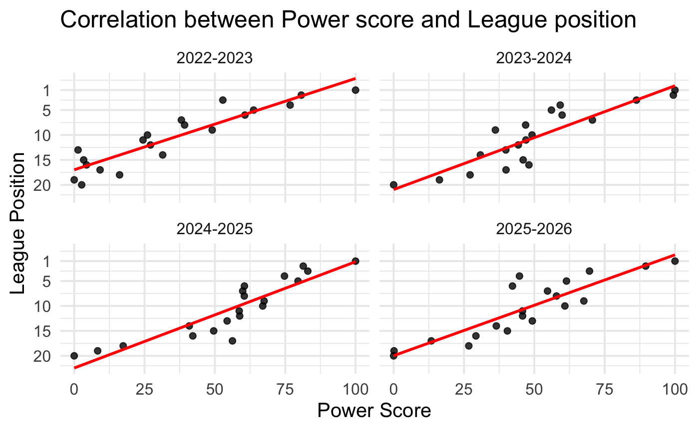
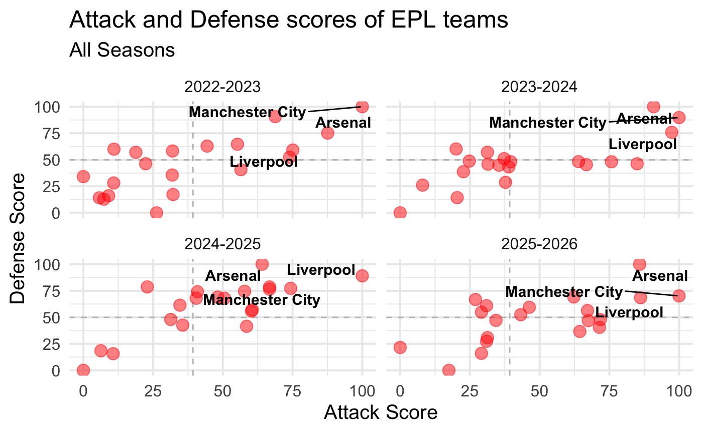
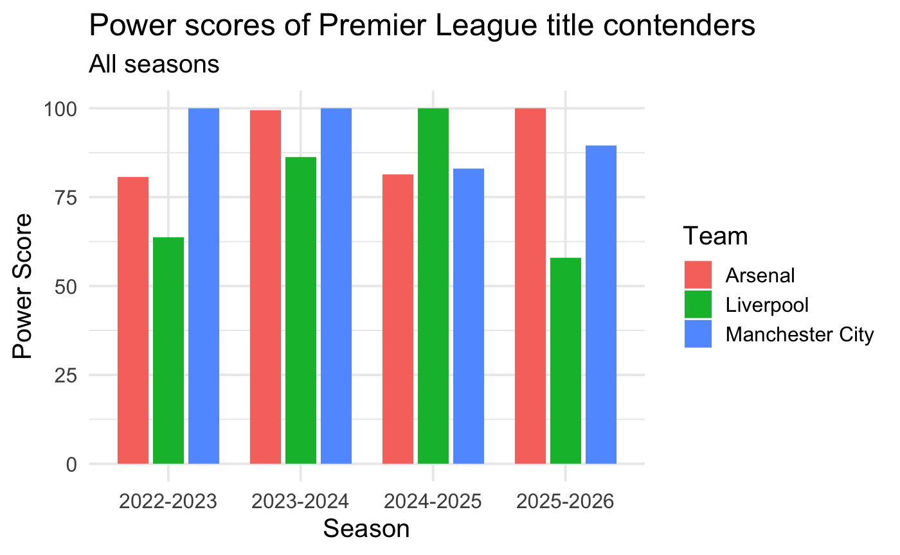
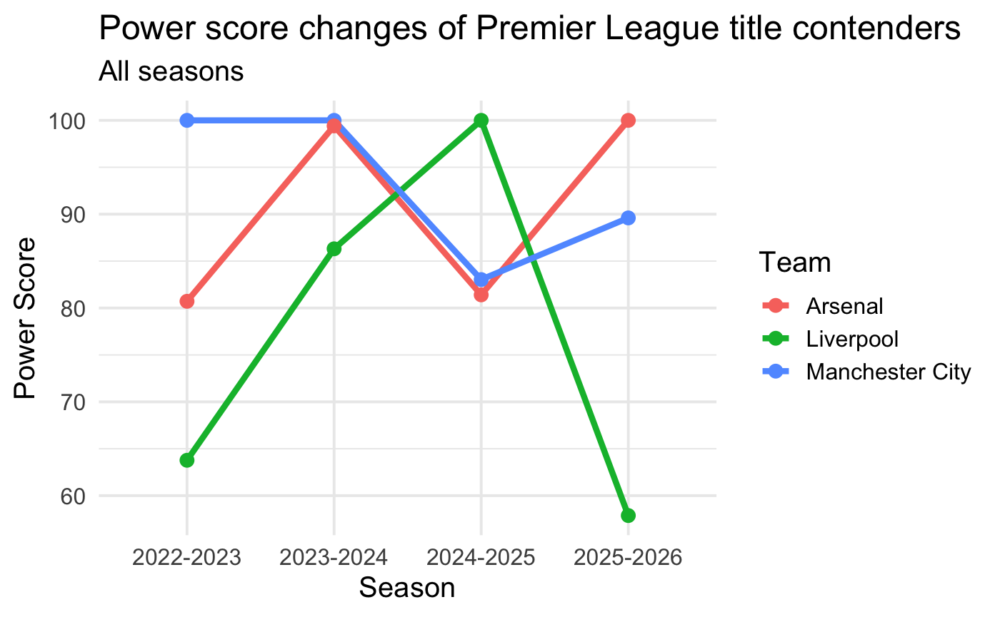

In this report we will analyze the causes of Arsenal Football Club
falling short of the English Premier League title in the seasons
2022-2023, 2023-2024, and 2024-2025 seasons, as these were the seasons
where the club mounted a serious title charge and fell short, finishing
2nd in each of these seasons. Although there are countless factors
contributing to Arsenal’s recent failure to win a championship, we will
mainly focus on the three factors: Attack, Defense, and Discipline and
use these to compare how Arsenal fares in comparison to other title
rivals, mainly Manchester City and Liverpool. We will also create a new
factor called Power Score, where it will be based on the other three
factors to calculate the “deservedness” of winning the Premier League
title. And lastly, alongside the last three seasons, we will also
analyze the current season until Gameweek 13, to predict if Arsenal will
win the Premier League title or not. So, we go ahead with two questions:

1.  Why Arsenal Failed to win the Premier League in the Last three
    seasons?
2.  Will Arsenal win the Premier League title this season? We will use
    multiple data visualizations to assist us in finding the likely
    potential answers to these questions.

We load five libraries: dplyr, scales, tidyr, ggplot2, and ggrepel for
our project. dplyr for various types of data manipulation, scales to
help us scale factors from 0-100, tidyr to create tidy datasets, ggplot2
for data visualization, and ggrpel for manipulating texts so they don’t
overlap with each other.

    library(dplyr)

    ## 
    ## Attaching package: 'dplyr'

    ## The following objects are masked from 'package:stats':
    ## 
    ##     filter, lag

    ## The following objects are masked from 'package:base':
    ## 
    ##     intersect, setdiff, setequal, union

    library(scales)
    library(tidyr)
    library(ggplot2)
    library(ggrepel)

Since I’ve downloaded the files rather than extracted from web link, I
have to set my current working directory to the one where the files are
and read the csv files. The source of the csv files are from Stathead
FBRef (<https://www.sports-reference.com/stathead/fbref/>). We’ve
filtered the data to find our desired options, converted the tables to
csv texts for copying, pasted them into a text editor and saved as a csv
file. There are three csv files: AttackandDefense.csv, which includes
Goals For (GF), Goals Against (GA), Expected Goals (xG), and Expected
Goal Difference (xGD), which will help us calculate the Attack and
Defense level of each team; Discipline.csv, which includes the number of
yellow, red, and double yellow cards, which will help us calculate the
impact of suspensions and sending-offs for each team;
LeagueStandings.csv, which includes the league position of every team.
All of these data are from seasons 2022-2023 up to 2025-2026 (Until
GW13).

    setwd("~/Desktop/Things you need/Study/HKU Year 2/Semester 1/COMP2501/COMP2501_Project_Report_Masud_Muradli")
    attdefdf <- read.csv("AttackandDefense.csv")
    discdf <- read.csv("Discipline.csv")
    leaguedf <- read.csv("LeagueStandings.csv")

Some column names of the dataframes above are little different. So, we
changed them below for tidying purposes.

    names(attdefdf)[names(attdefdf) == "Season."] <- "Season"
    names(discdf)[names(discdf) == "Season."] <- "Season"
    names(leaguedf)[names(leaguedf) == "LgRank."] <- "LgRank"

This is the function where the values of a vector are scaled from 0 to
100, with 100 being the highest and 0 being the lowest. If every element
in the vector is NA, the vector will return unchanged. If all of the
values of the vector are equal, 100 will be assigned to them. Then with
the function rescale, the vector will be scales from 0 to 100. Formula
is scaled\_value = (x - min(x)) / (max(x) - min(x)) \* 100, where x is a
value inside the vector.

    scale_0_100 <- function(x) {
      if (all(is.na(x))) {
        return(x)
      }
      if (max(x, na.rm = TRUE) == min(x, na.rm = TRUE)) {
        output <- rep(NA_real_, length(x))
        output[!is.na(x)] <- 100
        return(output)
      }
      rescale(x, to = c(0, 100))
    }

This is the Table of Attack Score for each team. Attack Score is the
scaling of the sum of Scored Goals (GF) and Expected Goals (xG) of every
team. xG is represented as xG.1 in the data frame attdefdf. It first
groups attdefdf by season, then adds a new column called AttackScore
where AttackScore = scale\_0\_100(GF + xG.1), then later selects the
columns Team, Season, and AttackScore. Attack is transformed into a
wider format as AttackScoreTable and the values are sorted by team name.

    Attack <- attdefdf |> 
      group_by(Season) |> 
      mutate(AttackScore = scale_0_100(GF + xG.1)) |> 
      ungroup() |> 
      select(Team, Season, AttackScore)

    AttackScoreTable <- Attack |> 
      pivot_wider(names_from = Season, values_from = AttackScore) |>
      arrange(Team)

This is the Table of Defense Score for each team. Defense Score is the
inverse scaling of the sum of Goals Conceded (GA) and Expected Goals
Against (xGA) of every team. First, Defense Point is calculated as GA +
xGA into attdefdf. xGA is calculated as xG - xGD. Then attdefdf is
grouped by season, a new column called DefenseScore where DefenseScore =
scale\_0\_100(max(DefensePoint) - DefensePoint) is added (NA is
ignored), and columns Team, Season, and DefenseScore are selected.
Defense is transformed into a wider format as DefenseScoreTable and the
values are sorted by team name.

    Defense <- attdefdf |>
      mutate(DefensePoint = GA + (xG - xGD)) |> 
        group_by(Season) |> 
          mutate(DefenseScore = scale_0_100(max(DefensePoint, na.rm = TRUE) - DefensePoint)) |> 
          ungroup() |> 
          select(Team, Season, DefenseScore)

    DefenseScoreTable <- Defense |> 
      pivot_wider(names_from = Season, values_from = DefenseScore) |> 
      arrange(Team)

This is the Table of Discipline Score for each team. Discipline Score is
the inverse scaling of (0.25 x Yellow Cards + 3 x Red Cards +
Double-Yellow Cards). The Calculations are done so to approximate the
potential impact a single card could have on a team’s performance.
First, Discipline Point is calculated as (0.25)CrdY + 3CrdR + X2CrdY
into discdf (CrdY is represented as CrdY.1). Then discdf is grouped by
season, a new column called DisciplineScore where DisciplineScore =
scale\_0\_100(max(DisciplinePoint) - DisciplinePoint) is added (NA is
ignored), and columns Team, Season, and DisciplineScore are selected.
Discipline is transformed into a wider format as DisciplineScoreTable
and the values are sorted by team name.

    Discipline <- discdf |> 
      mutate(DisciplinePoint = 0.25*CrdY.1 + 3*CrdR + X2CrdY) |> 
      group_by(Season) |> 
      mutate(DisciplineScore = scale_0_100(max(DisciplinePoint, na.rm = TRUE) - DisciplinePoint)) |> 
      ungroup() |> 
      select(Team, Season, DisciplineScore)

    DisciplineScoreTable <- Discipline |> 
      pivot_wider(names_from = Season, values_from = DisciplineScore) |> 
      arrange(Team)

However, calculating the Attack, Defense, and Discipline scores are not
sufficient enough to determine if Arsenal really deserved to win the
league or not. For this, we calculate Power Score, which is equal to
0.45 x Attack Score + 0.45 x Defense Score + 0.1 x Discipline Score,
scaled from 0 to 100. The calculations are done to show that the
Attacking and Defensive qualities matter more to the Team than its
Discipline. First, Defense and Discipline columns are added into Attack
data frame, then a new column called Power Score where PowerScore =
scale\_0\_100(0.45 \* AttackScore + 0.45 \* DefenseScore + 0.1 \*
DisciplineScore) is added. Then Team, Season and PowerScore columns are
selected from Power and transformed into a wider format as
PowerScoreTable and the values are sorted by team name.

    Power <- Attack |> 
      left_join(Defense, by = c("Team", "Season")) |> 
      left_join(Discipline, by = c("Team", "Season")) |> 
      group_by(Season) |> 
      mutate(PowerScore = scale_0_100(0.45 * AttackScore + 0.45 * DefenseScore + 0.1 * DisciplineScore)) |>
      ungroup()

    PowerScoreTable <- Power|>
      select(Team, Season, PowerScore) |>
      pivot_wider(names_from = Season, values_from = PowerScore) |> 
      arrange(Team)

This prints the Tables of each of the 4 factors for the seasons
2022-2023, 2023-2024 and 2024-2025. It is used for analyzing past data.
With this we can select a few points. In 2022-2023, Manchester City had
the best defense and Attack. In 2023-2024, Arsenal had the best defence,
but Manchester City had the best Attack. In 2024-2025, Liverpool had the
best attack, but Arsenal had the best defence. Discipline-wise, West
Ham, Luton Town, and Brentford had the best Discipline score in
2022-2023, 2023-2024 and 2024-2025, respectively. Now, looking at the
PowerScoreTable, we can see why the Premier League champions deserved to
be champions. Every team had a Power Score of 100 in the season they won
the Premier League.

    AttackScoreTable |> select("Team", "2024-2025", "2023-2024", "2022-2023") |> print(n = Inf)

    ## # A tibble: 25 × 4
    ##    Team            `2024-2025` `2023-2024` `2022-2023`
    ##    <chr>                 <dbl>       <dbl>       <dbl>
    ##  1 Arsenal               64.1        90.9        87.6 
    ##  2 Aston Villa           50.6        64.0        32.0 
    ##  3 Bournemouth           57.8        35.5         7.35
    ##  4 Brentford             60.5        39.6        44.4 
    ##  5 Brighton              60.3        37.3        74.0 
    ##  6 Burnley               NA           8.04       NA   
    ##  7 Chelsea               66.8        75.8        18.8 
    ##  8 Crystal Palace        48.1        31.3        11.0 
    ##  9 Everton               22.9        20.1        10.9 
    ## 10 Fulham                40.5        31.5        31.9 
    ## 11 Ipswich Town          10.7        NA          NA   
    ## 12 Leeds United          NA          NA          26.2 
    ## 13 Leicester City         6.30       NA          32.2 
    ## 14 Liverpool            100          97.4        75.1 
    ## 15 Luton Town            NA          20.4        NA   
    ## 16 Manchester City       74.3       100         100   
    ## 17 Manchester Utd        34.6        39.0        55.2 
    ## 18 Newcastle Utd         66.8        85.0        68.8 
    ## 19 Nott'ham Forest       40.9        24.8         9.06
    ## 20 Sheffield Utd         NA           0          NA   
    ## 21 Southampton            0          NA           5.73
    ## 22 Sunderland            NA          NA          NA   
    ## 23 Tottenham             58.5        66.8        56.5 
    ## 24 West Ham              31.3        37.8        22.3 
    ## 25 Wolves                35.6        22.7         0

    DefenseScoreTable |> select("Team", "2024-2025", "2023-2024", "2022-2023") |> print(n = Inf)

    ## # A tibble: 25 × 4
    ##    Team            `2024-2025` `2023-2024` `2022-2023`
    ##    <chr>                 <dbl>       <dbl>       <dbl>
    ##  1 Arsenal               100         100          75.1
    ##  2 Aston Villa            68.0        48.3        58.2
    ##  3 Bournemouth            74.5        44.9        12.9
    ##  4 Brentford              57.0        48.2        62.9
    ##  5 Brighton               55.9        51.1        52.4
    ##  6 Burnley                NA          26.1        NA  
    ##  7 Chelsea                78.6        48.1        57  
    ##  8 Crystal Palace         69.0        57.1        60  
    ##  9 Everton                78.6        60.1        28.1
    ## 10 Fulham                 68.0        45.8        35.6
    ## 11 Ipswich Town           15.7        NA          NA  
    ## 12 Leeds United           NA          NA           0  
    ## 13 Leicester City         18.5        NA          17.2
    ## 14 Liverpool              89.1        75.8        59.1
    ## 15 Luton Town             NA          14.3        NA  
    ## 16 Manchester City        77.2        89.7       100  
    ## 17 Manchester Utd         61.4        43.3        64.6
    ## 18 Newcastle Utd          76.5        46.2        90.6
    ## 19 Nott'ham Forest        74.1        48.7        16.1
    ## 20 Sheffield Utd          NA           0          NA  
    ## 21 Southampton             0          NA          14.1
    ## 22 Sunderland             NA          NA          NA  
    ## 23 Tottenham              41.5        45.4        40.6
    ## 24 West Ham               47.9        28.7        46.2
    ## 25 Wolves                 42.6        38.7        34.1

    DisciplineScoreTable |> select("Team", "2024-2025", "2023-2024", "2022-2023") |> print(n = Inf)

    ## # A tibble: 25 × 4
    ##    Team            `2024-2025` `2023-2024` `2022-2023`
    ##    <chr>                 <dbl>       <dbl>       <dbl>
    ##  1 Arsenal                15.8       79.4         94.0
    ##  2 Aston Villa            38.9       53.9         59.0
    ##  3 Bournemouth            37.9       56.9         79.5
    ##  4 Brentford             100         58.8         75.2
    ##  5 Brighton               49.5       46.1         88.0
    ##  6 Burnley                NA          0           NA  
    ##  7 Chelsea                42.1        7.84        30.8
    ##  8 Crystal Palace         30.5       66.7         29.9
    ##  9 Everton                62.1       73.5         44.4
    ## 10 Fulham                 68.4       28.4         59.0
    ## 11 Ipswich Town            0         NA           NA  
    ## 12 Leeds United           NA         NA           23.9
    ## 13 Leicester City         86.3       NA           56.4
    ## 14 Liverpool              65.3       35.3         78.6
    ## 15 Luton Town             NA        100           NA  
    ## 16 Manchester City        86.3       90.2         89.7
    ## 17 Manchester Utd         45.3       72.5         50.4
    ## 18 Newcastle Utd          93.7       76.5         75.2
    ## 19 Nott'ham Forest        49.5       46.1         65.8
    ## 20 Sheffield Utd          NA          0           NA  
    ## 21 Southampton            46.3       NA           75.2
    ## 22 Sunderland             NA         NA           NA  
    ## 23 Tottenham              85.3       24.5         37.6
    ## 24 West Ham               45.3       42.2        100  
    ## 25 Wolves                 61.1       14.7          0

    PowerScoreTable |> select("Team", "2024-2025", "2023-2024", "2022-2023") |> print(n = Inf)

    ## # A tibble: 25 × 4
    ##    Team            `2024-2025` `2023-2024` `2022-2023`
    ##    <chr>                 <dbl>       <dbl>       <dbl>
    ##  1 Arsenal               81.4         99.4       80.7 
    ##  2 Aston Villa           60.5         59.2       38.1 
    ##  3 Bournemouth           67.5         44.3        3.36
    ##  4 Brentford             67.0         48.1       49.0 
    ##  5 Brighton              60.5         47.0       60.7 
    ##  6 Burnley               NA           16.3       NA   
    ##  7 Chelsea               74.7         59.9       27.1 
    ##  8 Crystal Palace        58.8         49.2       24.5 
    ##  9 Everton               54.4         46.0        9.19
    ## 10 Fulham                58.6         39.9       26.0 
    ## 11 Ipswich Town           8.34        NA         NA   
    ## 12 Leeds United          NA           NA          0   
    ## 13 Leicester City        17.4         NA         16.1 
    ## 14 Liverpool            100           86.3       63.8 
    ## 15 Luton Town            NA           27.2       NA   
    ## 16 Manchester City       83.0        100        100   
    ## 17 Manchester Utd        49.6         46.9       52.8 
    ## 18 Newcastle Utd         79.6         70.7       76.7 
    ## 19 Nott'ham Forest       59.9         39.9        4.38
    ## 20 Sheffield Utd         NA            0         NA   
    ## 21 Southampton            0           NA          2.66
    ## 22 Sunderland            NA           NA         NA   
    ## 23 Tottenham             56.2         56.1       39.2 
    ## 24 West Ham              40.9         36.2       31.4 
    ## 25 Wolves                42.2         30.8        1.36

This prints the Tables of each of the 4 factors for the 2025-2026 season
until Gameweek 13, arranged in the descending order score-wise. It is
used for predictive purposes. Having analyzed the past seasons, we now
focus on the current season. Currently, Manchester City has the best
attack, and Arsenal has the best defence and Disciplinary record. When
we look at the power score, we can see that Arsenal currently has the
highest power score. So, we can predict that Arsenal is the most likely
team to win the Premier League this season and if it continues like
this, they will deservedly win so. We will now do data visualization to
demonstrate why the calculations we made until now makes sense.

    AttackScoreTable |> select("Team", "2025-2026") |> arrange(desc(`2025-2026`)) |> print(n = Inf)

    ## # A tibble: 25 × 2
    ##    Team            `2025-2026`
    ##    <chr>                 <dbl>
    ##  1 Manchester City       100  
    ##  2 Chelsea                86.2
    ##  3 Arsenal                85.9
    ##  4 Brentford              71.8
    ##  5 Manchester Utd         71.5
    ##  6 Liverpool              67.5
    ##  7 Brighton               67.2
    ##  8 Bournemouth            64.4
    ##  9 Crystal Palace         62.3
    ## 10 Newcastle Utd          46.3
    ## 11 Tottenham              43.3
    ## 12 Everton                34.4
    ## 13 Nott'ham Forest        31.3
    ## 14 Leeds United           31.0
    ## 15 Sunderland             31.0
    ## 16 Fulham                 29.1
    ## 17 West Ham               29.1
    ## 18 Aston Villa            27.0
    ## 19 Burnley                17.5
    ## 20 Wolves                  0  
    ## 21 Ipswich Town           NA  
    ## 22 Leicester City         NA  
    ## 23 Luton Town             NA  
    ## 24 Sheffield Utd          NA  
    ## 25 Southampton            NA

    DefenseScoreTable |> select("Team", "2025-2026") |> arrange(desc(`2025-2026`)) |> print(n = Inf)

    ## # A tibble: 25 × 2
    ##    Team            `2025-2026`
    ##    <chr>                 <dbl>
    ##  1 Arsenal               100  
    ##  2 Manchester City        70.1
    ##  3 Crystal Palace         69.2
    ##  4 Chelsea                68.4
    ##  5 Aston Villa            66.7
    ##  6 Sunderland             60.9
    ##  7 Newcastle Utd          59.5
    ##  8 Brighton               56.3
    ##  9 Fulham                 54.9
    ## 10 Tottenham              52.4
    ## 11 Brentford              47.8
    ## 12 Everton                47.1
    ## 13 Liverpool              46.8
    ## 14 Manchester Utd         40.5
    ## 15 Bournemouth            36.7
    ## 16 Nott'ham Forest        30.8
    ## 17 Leeds United           27.4
    ## 18 Wolves                 21.6
    ## 19 West Ham               16.0
    ## 20 Burnley                 0  
    ## 21 Ipswich Town           NA  
    ## 22 Leicester City         NA  
    ## 23 Luton Town             NA  
    ## 24 Sheffield Utd          NA  
    ## 25 Southampton            NA

    DisciplineScoreTable |> select("Team", "2025-2026") |> arrange(desc(`2025-2026`)) |> print(n = Inf)

    ## # A tibble: 25 × 2
    ##    Team            `2025-2026`
    ##    <chr>                 <dbl>
    ##  1 Arsenal               100  
    ##  2 Nott'ham Forest        96.7
    ##  3 Leeds United           93.4
    ##  4 Brentford              88.5
    ##  5 Crystal Palace         88.5
    ##  6 Liverpool              88.5
    ##  7 Manchester City        88.5
    ##  8 Fulham                 86.9
    ##  9 Aston Villa            77.0
    ## 10 Tottenham              77.0
    ## 11 Brighton               75.4
    ## 12 Manchester Utd         73.8
    ## 13 Burnley                67.2
    ## 14 Everton                67.2
    ## 15 Sunderland             65.6
    ## 16 Newcastle Utd          59.0
    ## 17 Bournemouth            52.5
    ## 18 West Ham               47.5
    ## 19 Wolves                 47.5
    ## 20 Chelsea                 0  
    ## 21 Ipswich Town           NA  
    ## 22 Leicester City         NA  
    ## 23 Luton Town             NA  
    ## 24 Sheffield Utd          NA  
    ## 25 Southampton            NA

    PowerScoreTable |> select("Team", "2025-2026") |> arrange(desc(`2025-2026`)) |> print(n = Inf)

    ## # A tibble: 25 × 2
    ##    Team            `2025-2026`
    ##    <chr>                 <dbl>
    ##  1 Arsenal             100    
    ##  2 Manchester City      89.6  
    ##  3 Chelsea              69.6  
    ##  4 Crystal Palace       67.6  
    ##  5 Brighton             61.4  
    ##  6 Brentford            60.9  
    ##  7 Liverpool            57.9  
    ##  8 Manchester Utd       54.7  
    ##  9 Newcastle Utd        49.3  
    ## 10 Tottenham            45.8  
    ## 11 Bournemouth          45.8  
    ## 12 Aston Villa          44.7  
    ## 13 Sunderland           42.2  
    ## 14 Fulham               40.4  
    ## 15 Everton              36.5  
    ## 16 Nott'ham Forest      29.2  
    ## 17 Leeds United         26.7  
    ## 18 West Ham             13.4  
    ## 19 Burnley               0.145
    ## 20 Wolves                0    
    ## 21 Ipswich Town         NA    
    ## 22 Leicester City       NA    
    ## 23 Luton Town           NA    
    ## 24 Sheffield Utd        NA    
    ## 25 Southampton          NA

This is the correlation plot between power score and league position of
each team for every season. After creating the plot, we can see that the
distance between the points and the correlation line is actually close,
making our method of calculating the power score decently accurate.

    league_select <- leaguedf |> select("Team", "Season", "LgRank")

    PowerAndLeague <- Power |> 
      left_join(league_select, by = c("Team", "Season")) |> 
      filter(!is.na(PowerScore), !is.na(LgRank))

    PowerAndLeague |> 
      ggplot(aes(x = PowerScore, y = LgRank)) + 
      geom_point(size = 2, alpha = 0.8) + 
      geom_smooth(method = "lm", linewidth = 1, se = FALSE, color = "red") + 
      scale_y_reverse(breaks = c(1, 5, 10, 15, 20)) + 
      facet_wrap(~Season, ncol = 2) + 
      labs(title = "Correlation between Power score and League position", x = "Power Score", y = "League Position") + theme_minimal(base_size = 15)

    ## `geom_smooth()` using formula = 'y ~ x'

This is the quadrant plot between attack and defense scores of each team
for every season. After creating the plot, we can see that the league
title contenders fall into the top-right quadrant and the ones with both
the best attack and defense overall (major contributors to the power
score) become champions of the Premier League.

    quadrantdf <- Power |> 
      select(Team, Season, AttackScore, DefenseScore)

    quadrantMedians <- quadrantdf |>
      group_by(Season) |>
      summarize(attmedian = median(quadrantdf$AttackScore, na.rm = TRUE),
                defmedian = median(quadrantdf$DefenseScore, na.rm = TRUE))

    important_labels <- c("Arsenal", "Manchester City", "Liverpool")

    labelsdf <- quadrantdf |>
      left_join(quadrantMedians, by = "Season") |>
      filter(Team %in% important_labels)

    quadrantdf |> 
      left_join(quadrantMedians, by = "Season") |>
      ggplot(aes(x = AttackScore, y = DefenseScore, label = Team)) +
      geom_vline(aes(xintercept = attmedian), linetype = "dashed", color = "gray") +
      geom_hline(aes(yintercept = defmedian), linetype = "dashed", color = "gray") +
      geom_point(size = 4, color = "red", alpha = 0.5) + 
      facet_wrap(~Season, ncol = 2) +
      geom_text_repel(data = labelsdf, aes(label = Team), size = 4, fontface = "bold") + 
      labs(title = "Attack and Defense scores of EPL teams", subtitle = "All Seasons", 
           x = "Attack Score", y = "Defense Score") + 
      theme_minimal(base_size = 15)

This is the bar plot comparing the power scores of Arsenal, Manchester
City and Liverpool for every season. After creating the plot, we can see
how Arsenal and its title rivals’ power scores changed over the seasons
and is a factor in showing the likeliness of Arsenal winning the Premier
League this season.

    PowerTitleContenders <- Power |>
      filter(Team %in% important_labels)

    PowerTitleContenders |>
      ggplot(aes(x = Season, y = PowerScore, fill = Team)) +
      geom_bar(stat = "identity", position = position_dodge(width = 0.8), width = 0.7) +
      labs(title = "Power scores of Premier League title contenders", subtitle = "All seasons",
           x = "Season", y = "Power Score", 
           fill = "Team") +
      theme_minimal(base_size = 15)

This is the line plot comparing the power scores of Arsenal, Manchester
City and Liverpool for every season. After creating the plot, we can see
how Arsenal and its title rivals’ power scores changed over the seasons
and is a factor in showing the likeliness of Arsenal winning the Premier
League this season.

    PowerTitleContenders |>
      ggplot(aes(x=Season, y=PowerScore, group=Team, color=Team)) +
      geom_line(linewidth = 1.5) +
      geom_point(size = 3) +
      labs(title = "Power score changes of Premier League title contenders", subtitle = "All seasons",
           x = "Season", y = "Power Score", 
           fill = "Team") +
      theme_minimal(base_size = 15)

